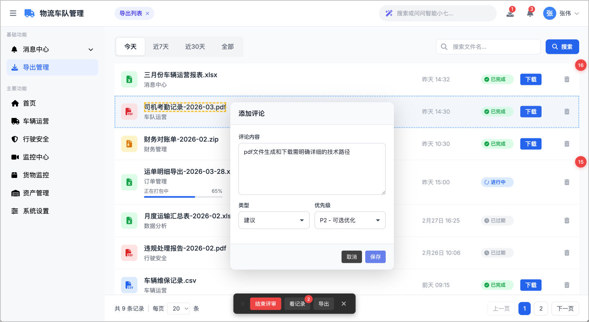
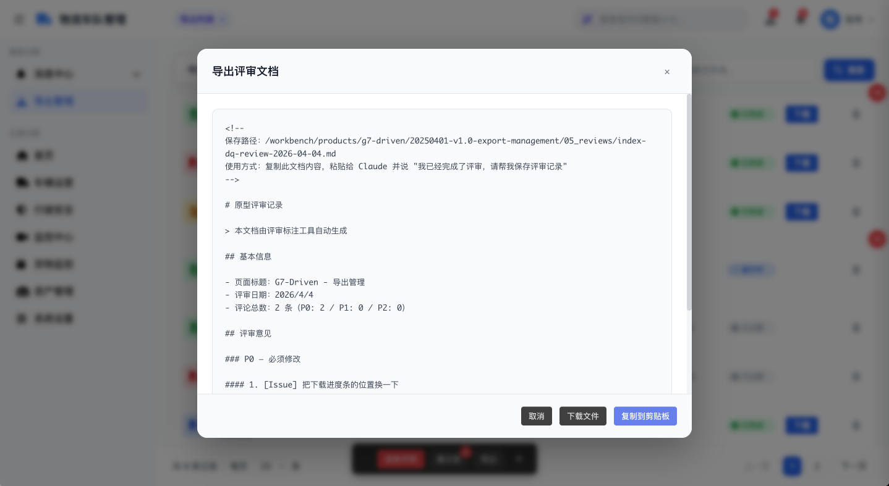
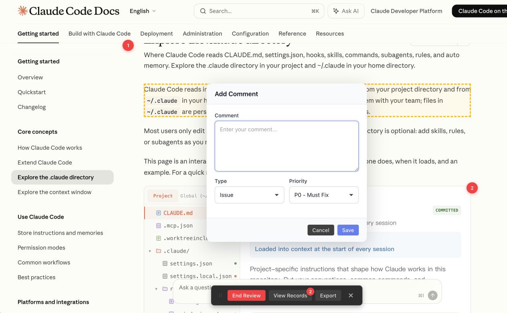

# 评审助手 Review Assistant

**为 HTML 原型页面添加评审标注，自动生成优化待办表**

[English](#english) | [中文](#中文)

---

## 中文

### ✨ 核心功能

#### 可视化标注
- 🎯 **点击即标注**：点击页面任意元素添加评审评论，自动生成编号角标
- 🔗 **双向联动**：点击角标高亮评论卡片，点击卡片定位页面元素并显示参考框
- 📍 **精准定位**：使用 CSS.escape + 降级策略，解决特殊字符页面的定位失败

#### 评论管理
- 📝 **分类标注**：支持问题/建议/决策/待确认四种类型
- 🎨 **三级优先级**：P0（必须修改）、P1（建议修改）、P2（可选优化）
- ✏️ **实时编辑**：支持编辑、删除、定位等操作，每次操作自动保存

#### 数据持久化
- 💾 **智能存储**：基于项目名+文件名存储，服务器重启/端口变化不影响数据
- 🔄 **标记持久化**：使用 Map 存储标记引用，退出评审模式不丢失角标
- 📊 **一键导出**：生成 Markdown 格式的优化待办表，可直接作为设计优化输入

#### 交互体验
- 🎭 **无侵入式**：所有 UI 使用最高 z-index + 独立样式，不污染原型页面
- 🖱️ **拖拽面板**：评审操控面板可拖动，不遮挡内容
- 📱 **右侧抽屉**：评论列表毛玻璃效果，优雅展示
- 📜 **全局滚动监听**：捕获模式监听，覆盖所有嵌套滚动容器内的标记
- 🌗 **自动主题切换**：检测页面周边颜色，自动切换亮色/暗色面板主题，适配不同背景

#### 国际化支持
- 🌍 **中英文双语**：根据浏览器语言自动切换界面语言
- 🎨 **古钱币设计**：外圆内方的中国风 logo 设计

### 🚀 快速开始

#### 安装方式

**方式一：从源码安装（开发者模式）**

1. 克隆或下载本仓库
2. 打开 Chrome 浏览器，访问 `chrome://extensions/`
3. 开启右上角的"开发者模式"
4. 点击"加载已解压的扩展程序"
5. 选择本项目的根目录

**方式二：从 Chrome Web Store 安装（即将上线）**

待发布到 Chrome Web Store 后，可直接在线安装。

#### 使用方法

1. 打开任意 HTML 原型页面
2. **双击 ESC 键**呼出评审面板
3. 点击"开始评审"进入评审模式
4. 点击页面上的任意元素添加评论
5. 填写评论内容，选择类型和优先级
6. 完成评审后，点击"导出"生成优化待办表

### 📸 界面预览

#### 评审面板

浮动面板，显示所有评审标注和操作按钮：

#### 导出结果

一键导出 Markdown 格式的优化待办表：

### 📋 技术栈

- **Manifest V3**：使用最新的 Chrome 扩展规范
- **原生 JavaScript**：无框架依赖，轻量高效
- **CSS3**：现代化的界面设计
- **Chrome Storage API**：本地数据存储

### 🔒 隐私保护

- ✅ 所有数据仅存储在本地浏览器
- ✅ 不收集任何个人信息
- ✅ 不上传到任何服务器
- ✅ 开源代码，可审计

### 📄 许可证

本项目采用 [MIT License](LICENSE) 开源协议。

### 🤝 贡献

欢迎提交 Issue 和 Pull Request！

### 📦 更新日志

#### v2.8.0（2026-04-11）
- 🖼️ **iframe 嵌套页面兼容**：支持在 iframe 内的页面进行评审标注
- 💾 **备份与恢复**：新增 JSON 备份、HTML 评审副本导出和备份恢复功能，避免评论数据丢失；恢复时自动校验来源页面，防止误导入
- 💬 **角标悬浮弹窗**：鼠标悬停角标显示评论内容，点击可内联编辑

#### v2.7.0
- 🎭 主题切换彩蛋 + 角标 Q 弹入场动画
- 🌗 自动主题切换（检测页面背景色）
- 🎨 自定义下拉框、UI 优化

### ⚠️ 免责声明

本插件仅供合法用途，使用风险自担，开发者不对使用导致的任何损失负责。

---

## English

### ✨ Core Features

#### Visual Annotation
- 🎯 **Click to Annotate**: Click any page element to add review comments with auto-generated numbered badges
- 🔗 **Bidirectional Linking**: Click badge to highlight comment card, click card to locate element with reference box
- 📍 **Precise Positioning**: Uses CSS.escape + fallback strategy to handle special characters in selectors

#### Comment Management
- 📝 **Categorized Annotations**: Support for Issue/Suggestion/Decision/Pending types
- 🎨 **Three Priority Levels**: P0 (Must Fix), P1 (Should Fix), P2 (Nice to Have)
- ✏️ **Real-time Editing**: Edit, delete, locate operations with auto-save

#### Data Persistence
- 💾 **Smart Storage**: Project + filename based storage, survives server restarts/port changes
- 🔄 **Marker Persistence**: Map-based marker references, annotations persist after exiting review mode
- 📊 **One-Click Export**: Generate Markdown optimization checklists for design input

#### Interaction Experience
- 🎭 **Non-intrusive**: Highest z-index + isolated styles, no pollution to prototype pages
- 🖱️ **Draggable Panel**: Review control panel can be dragged to avoid blocking content
- 📱 **Side Drawer**: Comment list with frosted glass effect, elegant display
- 📜 **Global Scroll Listener**: Capture mode listening covers all nested scroll containers
- 🌗 **Auto Theme Switching**: Detects page surrounding colors and automatically switches between light/dark panel themes to adapt to different backgrounds

#### Internationalization
- 🌍 **Bilingual Support**: Auto-switches between Chinese and English based on browser language
- 🎨 **Ancient Coin Design**: Chinese-style logo with circular exterior and square interior

### 🚀 Quick Start

#### Installation

**Option 1: Install from Source (Developer Mode)**

1. Clone or download this repository
2. Open Chrome and navigate to `chrome://extensions/`
3. Enable "Developer mode" in the top right
4. Click "Load unpacked"
5. Select the project root directory

**Option 2: Install from Chrome Web Store (Coming Soon)**

Will be available for direct installation once published to Chrome Web Store.

#### Usage

1. Open any HTML prototype page
2. **Double press ESC** to open the review panel
3. Click "Start Review" to enter review mode
4. Click any element on the page to add a comment
5. Fill in comment content, select type and priority
6. After completing review, click "Export" to generate optimization checklist

### 📸 Screenshots

#### Review Panel

Floating panel displaying all review annotations and action buttons:

### 📋 Tech Stack

- **Manifest V3**: Latest Chrome extension specification
- **Vanilla JavaScript**: No framework dependencies, lightweight and efficient
- **CSS3**: Modern interface design
- **Chrome Storage API**: Local data storage

### 🔒 Privacy

- ✅ All data stored locally in browser only
- ✅ No personal information collected
- ✅ No data uploaded to servers
- ✅ Open source code, auditable

### 📄 License

This project is licensed under the [MIT License](LICENSE).

### 🤝 Contributing

Issues and Pull Requests are welcome!

### 📦 Changelog

#### v2.8.0 (2026-04-11)
- 🖼️ **iframe Support**: Review and annotate pages inside iframes
- 💾 **Backup & Restore**: Export JSON backups, HTML review copies, and restore from backups to prevent data loss; auto-validates backup source to prevent mismatched imports
- 💬 **Marker Hover Popup**: Hover over badges to preview comments, click to edit inline

#### v2.7.0
- 🎭 Theme switch easter egg + bouncy badge entrance animation
- 🌗 Auto theme switching (detects page background color)
- 🎨 Custom dropdowns, UI improvements

### ⚠️ Disclaimer

This extension is for lawful use only. Use at your own risk. The developer is not responsible for any losses caused by its use.

---

**Made with ❤️ by dengqu**

[GitHub](https://github.com/dengqu-netizen/review-extension) • [Report Bug](https://github.com/dengqu-netizen/review-extension/issues) • [Request Feature](https://github.com/dengqu-netizen/review-extension/issues)

